# Sarah Hatch - Portfolio of work on Rubbish Rumble

## Project

Rubbish Rumble is a two to four player couch coop game made in Unreal 
by a team of eight students as 
a class project for WPI's class IMGD 4000/4500 (Technical Game Dev II).

## What I worked on

On Rubbish Rumble I built two post processing shaders, handled in engine organization of assets 
and materials, built level enviroment art, and acted as the project manager.
I also did a small amount of gameplay programming.

### Shaders
#### Cell Shader
I built a simple three tone post processing cell shader, that works by taking a greyscale version of
the view and dividing it into flat shadow bands before mixing it back with the unlit color of the
object in the scene.
In building this shader, I referenced [PrismaticaDev's video](https://www.youtube.com/watch?v=RkFwe7JI8R8)
which allowed me to add colored lighting back into the shader.
 
To limit jittering in cell shader caused by jittering shadows, I turned off Lumen for both Dynamic Global Illumination as well as Dynamic Reflections. This forced all the lighting to be built but removed the shadow fluctuations. Since our game's lighting was already planned to be a stationary skylight this was not an issue for us.

Flat colors (Assets by Irene Wu and Chloe Luongo)

Textured
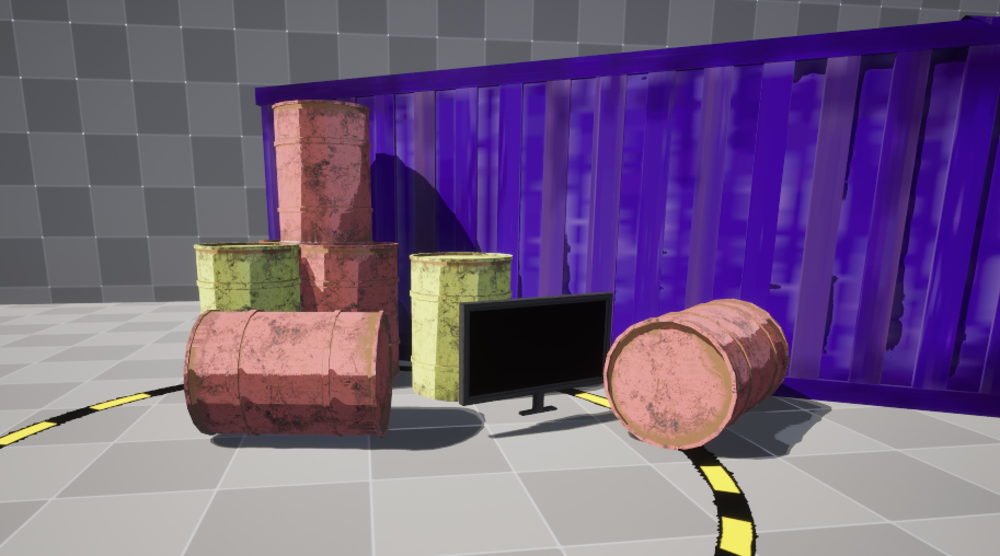

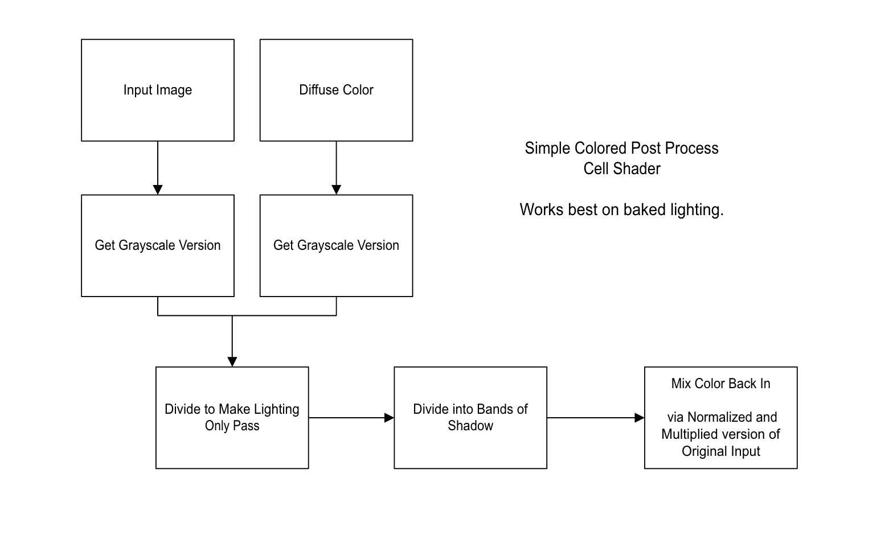

#### Line Art Shader 
A post processing shader that uses edge detection image kernels to make lineart. It draws lines based on both the distance map and the normal map, to allow for outlines of objects as well as lines on objects themselves.
This shader has some jitter in the editor in Unreal which disappears on build.

Flat colors and lineart(Assets by Irene Wu and Chloe Luongo)
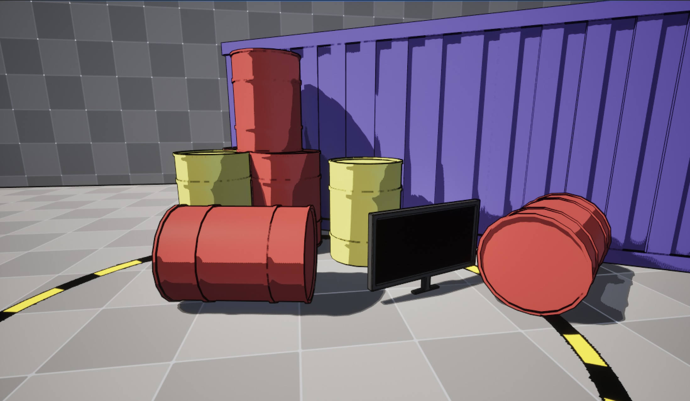
Textured and lineart
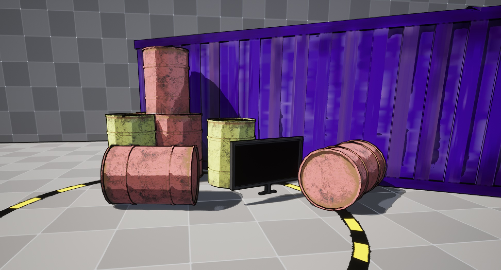
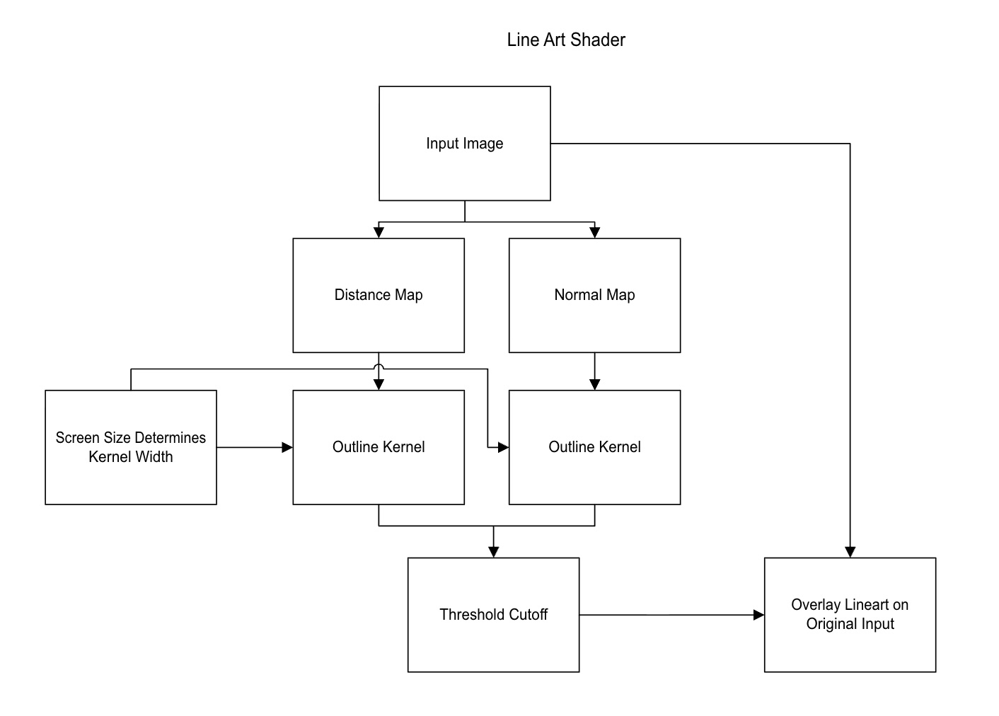

### Level design and Level Environment Art 
I was given a basic grey box of the world and a set of assets from our art team. From there I populated the world with assets, building the piles that made up the environment of the junkyard. I also determined where to place the item spawn zones to ensure people were moving and staying largely in the center area. 
During playtesting we received the feedback that the level was too large. There were multiple iterations where I decreased the level size to keep players closer to their opponent.

Trash Piles Early Design (Assets by Irene Wu and Chloe Luongo)
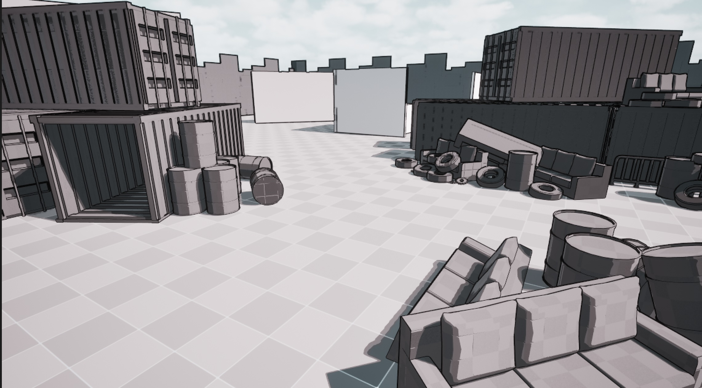
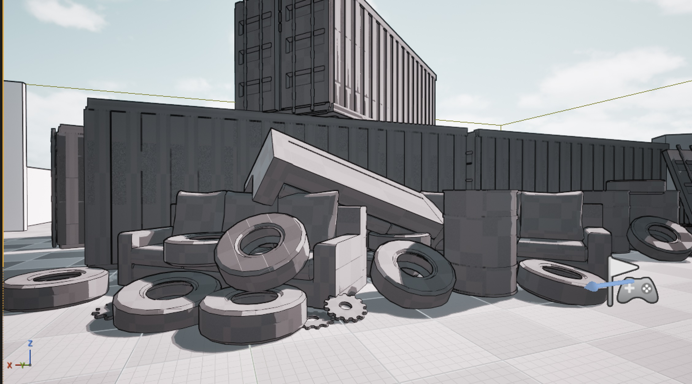

Level Layout (Assets by Irene Wu and Chloe Luongo)
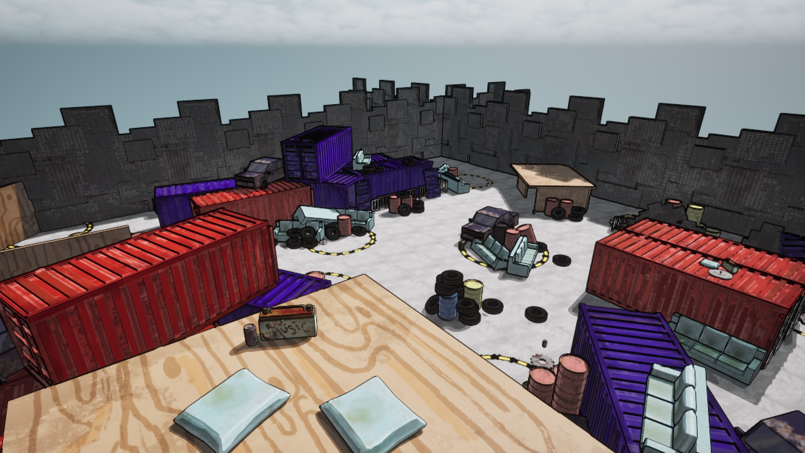
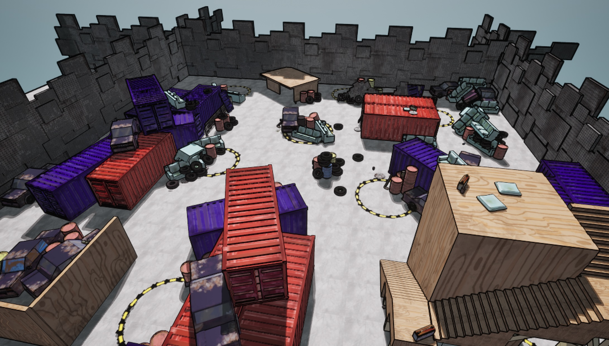

Closeups (Assets by Irene Wu and Chloe Luongo)
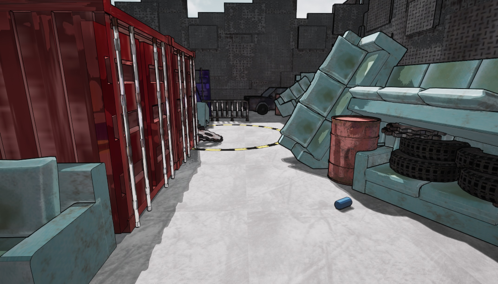
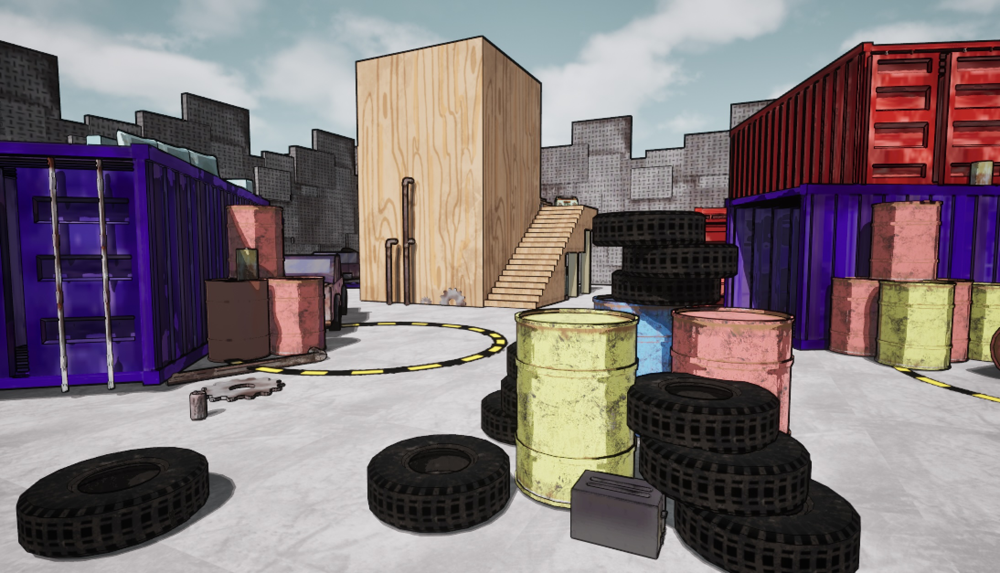
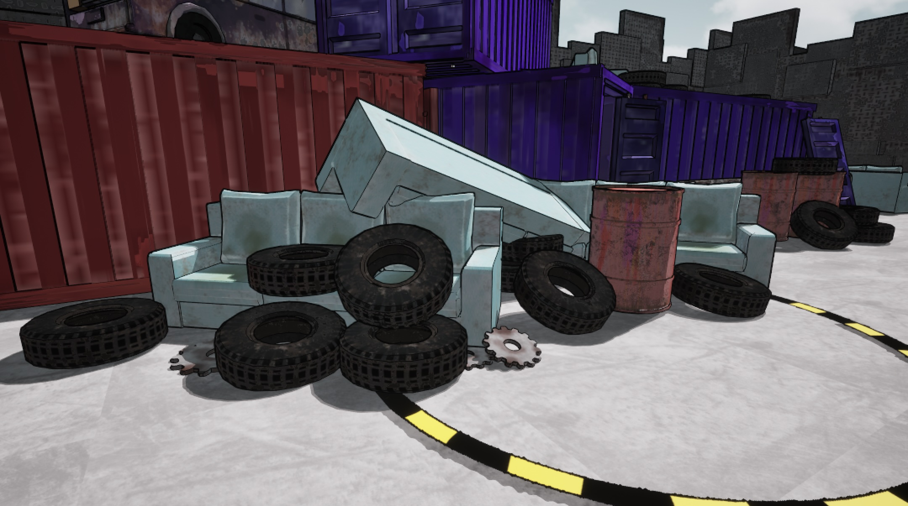

### Project Management
I developed and maintained the asset sheets for Rubbish Rumble. We had three asset sheets (one for 3d models, one for sound, and one for tech features), as well as a file checkout spreadsheet. During meetings I ran our group discussion of what needed to be done that day and what everyone was working on. I was also the point person for communication with the artists.

Asset Lists
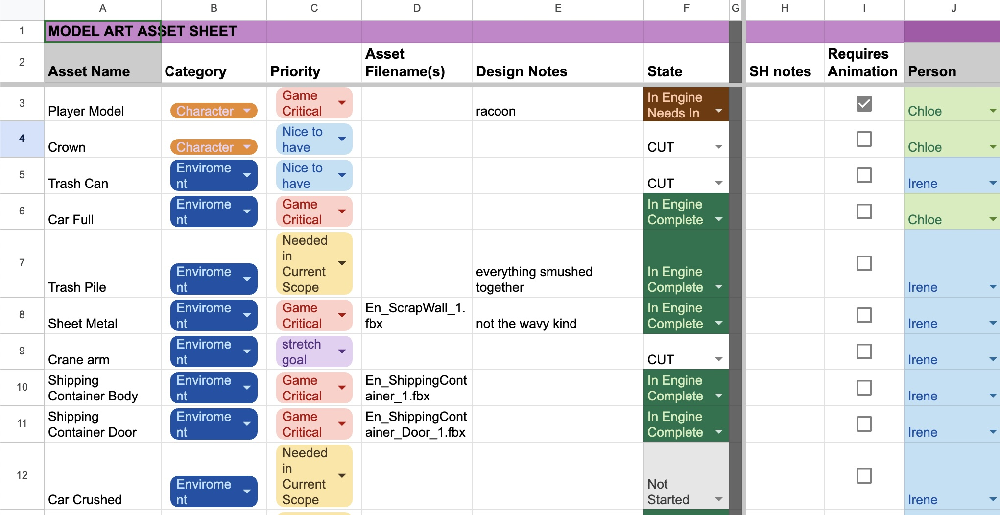
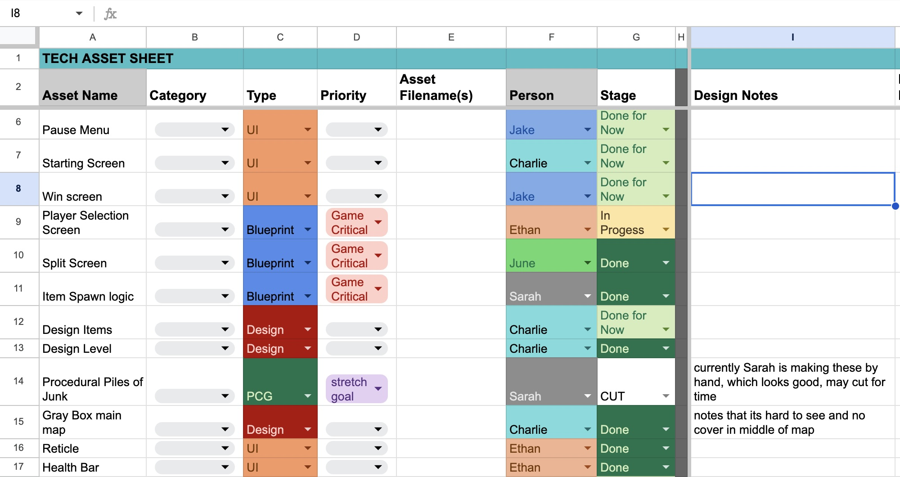
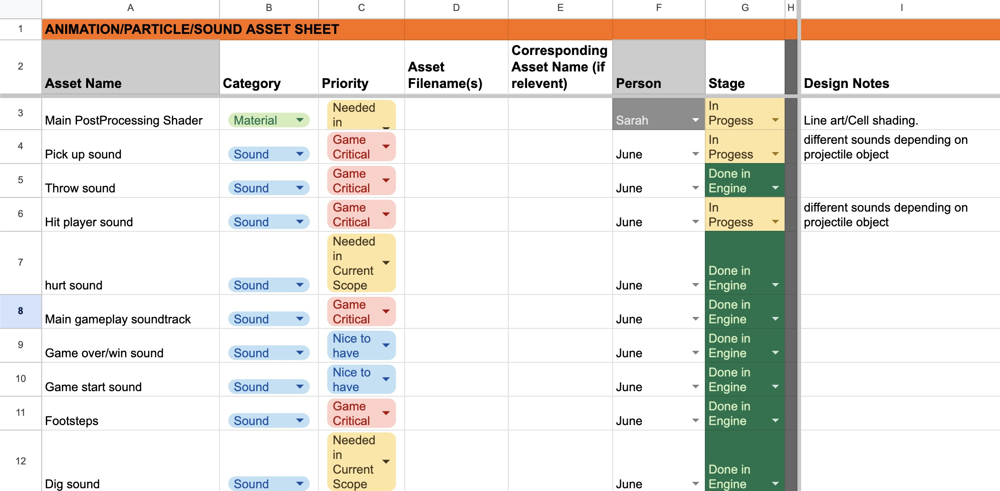
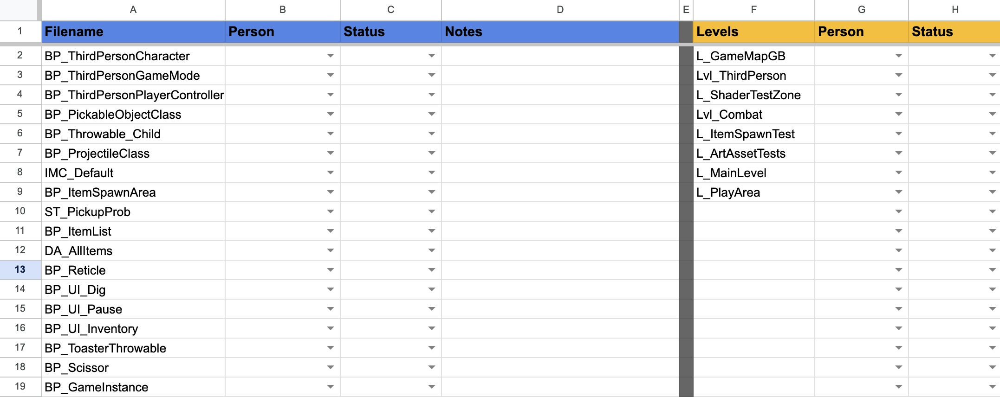
    

### Item Spawn Programming
While my focus was primarily on art implementation in the engine, I did do some gameplay programming. The feature I primarily worked on was the backend of the item spawn zones. I built the base class where the player could repeatedly click the controller while standing in the area and a random selection of items would spawn. I also made a data structure class where our programmers could add future items.
The UI, animation, and particles were added later by other team members.

## Project Challenges

### Dynamic Lineart Width
While working on the line art shader there was an issue where when there were different numbers of players in game the line art would appear to be a different width. Originally I wondered if the post processing shader was being applied several times, however this turned out to be because the screen size was changing and the shader lines were constant. To fix this I made the line width proportional to the size of the screen, so as the screen size shrinks so does the size of the kernel used to make lines. Smaller kernels means a thinner line.

### Art File Troubles
The other major challenge of this project was that not all of the art files were in the same format. For instance there were errors with pivot location, scale, and uv maps not aligning. A lot of time was spent fixing the files in Unreal Engine so they could be usable. This however meant that it was difficult to edit the objects further. As the project was coming to an end this was a reasonable solution, however having a stricter procedure for creating files would have prevented these problems. For future projects I would recommend deciding on the format initially, doing test imports of all the file types, and receiving art files in smaller batches. This is definitely something I will keep in mind in future projects.
  
### Version Control
Rubbish Rumble used Github as our version control software and google drive to pass art files.
Using Github with Unreal has some challenges, namely that due to binary storing of unreal files it is nearly impossible to merge Unreal files. To combat this I set up a file checkout system using google sheets. With a small team we were also able to communicate regularly who was working on what and keep developments mostly to the specific tool one was working on. We each worked on a separate branch and regularly pulled and pushed from main.
This was not without challenges and for a larger team I don’t think Github would be a good choice but for our small team it worked well enough.
